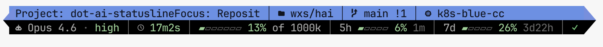

# cc-statusline

[](https://github.com/vtmocanu/cc-statusline/actions)
[](https://github.com/vtmocanu/cc-statusline/releases)
[](LICENSE)

A two-line, ANSI-colored statusline for [Claude Code](https://claude.com/claude-code) with project-aware colors, git status, Kubernetes context, rate-limit bars, Claude service health, and AI-generated session topics.



> Design notes, screenshots, and the story behind the script: **[Custom Claude Code Status Line on hai.wxs.ro](https://hai.wxs.ro/ai-stuff/claude-statusline/)**

## Features

- **Two-line layout** with project-colored top line and dark bottom line
- **Per-project background color** (12-color palette, hashed from session/cwd, manually overridable)
- **Git info**: branch, staged/modified/untracked counts
- **Kubernetes context**: current `kubectl` context (with timeout to avoid exec-auth hangs)
- **Session metrics**: model name, effort level (low/medium/high/max), elapsed time, session cost in USD (from Claude Code's `cost.total_cost_usd`; hide with `STATUSLINE_COST=0`)
- **Context window**: colored bar and percentage
- **Cache hit rate**: prompt-cache efficiency of the last API call (green when most of the context is cached, coral when cold); off by default, enable with `STATUSLINE_CACHE=1` (hidden anyway before the first call and after `/compact`)
- **Rate limits**: 5h and 7d bars with reset countdowns, progressively compacted to fit available width; shared across your sessions via a small per-user cache, so an idle session never shows numbers staler than your account's latest known state
- **Pace arrows**: optional `↑`/`→` after a rate-limit % projecting whether you'll exhaust the window before it resets (coral = will overshoot, gold = on pace, nothing = safe)
- **Claude service status**: auto-refreshed every 60s from `status.claude.com`
- **Session topic**: optional hook calls Claude Haiku to label each session with `Project: Focus`
- **Tab title**: sets the terminal tab title from the topic or directory
- **Width-aware truncation**: K8s context, branch, and topic shrink first to keep line 1 under the soft limit before Claude Code's `cli-truncate` drops line 2

## Requirements

- macOS or Linux
- `bash` 4 or newer
- `jq`
- `perl` (for ANSI-aware width measurement)
- `curl` (for service status and the optional session-topic hook)
- GNU `timeout` (coreutils; not stock on macOS)
- A [Nerd Font](https://www.nerdfonts.com/) in your terminal for the icons

### Per-OS dependency install

| OS | Command |
|---|---|
| macOS (Homebrew) | `brew install bash jq perl curl coreutils` |
| Debian/Ubuntu | `sudo apt install bash jq perl curl` |
| Fedora/RHEL | `sudo dnf install bash jq perl curl` |
| Arch | `sudo pacman -S bash jq perl curl` |
| Alpine | `apk add bash jq perl curl coreutils` |

The Homebrew install below pulls these in automatically, except `bash` (your system's copy works; the scripts avoid bash-4-only features) and the font.

## Install

### Homebrew (recommended)

```bash
brew tap vtmocanu/tap
brew trust vtmocanu/tap    # Homebrew 6.0+ requires trusting third-party taps
brew install cc-statusline
```

On Homebrew older than 6.0 the `brew trust` line doesn't exist; skip it (`brew install vtmocanu/tap/cc-statusline` also works there as a one-liner). If you'd rather not trust the whole tap, `brew trust --formula vtmocanu/tap/cc-statusline` scopes it to this formula.

The install puts `cc-statusline` on your PATH, declares the dependencies, and prints the `settings.json` snippets to paste (also shown by `brew info cc-statusline`). Point Claude Code at it:

```json
{
  "statusLine": {
    "type": "command",
    "command": "cc-statusline",
    "refreshInterval": 60
  }
}
```

Upgrades are just `brew upgrade cc-statusline`; no settings change across versions.

Hacking on a clone while keeping the brew setup? Write your working-tree path to `~/.config/cc-statusline/dev-dir` and the `cc-statusline` wrapper runs that copy instead (delete the file to switch back):

```bash
mkdir -p ~/.config/cc-statusline
echo ~/src/cc-statusline > ~/.config/cc-statusline/dev-dir
```

### install.sh (any platform, no Homebrew)

```bash
git clone https://github.com/vtmocanu/cc-statusline.git
cd cc-statusline
./install.sh
```

The installer extracts the chosen ref via `git archive` (so it never mutates your working tree), copies the scripts into `~/.local/share/cc-statusline/`, and prints the JSON snippets you need to paste into `~/.claude/settings.json`.

To pin a specific release:

```bash
./install.sh --version v2.1.0
```

To uninstall:

```bash
./install.sh --uninstall
```

To install into a custom prefix:

```bash
CC_STATUSLINE_PREFIX=/opt/cc-statusline ./install.sh
```

## Manual install

If you'd rather skip `install.sh`, point `statusLine.command` directly at your clone:

```json
{
  "statusLine": {
    "type": "command",
    "command": "bash /absolute/path/to/cc-statusline/statusline.sh",
    "refreshInterval": 60
  }
}
```

`refreshInterval` (seconds) re-runs the statusline on a timer in addition to activity-driven updates, so idle sessions keep fresh rate-limit reset times, service health, and usage bars. It requires a recent Claude Code version; remove the line to update only on activity. Rate-limit bars specifically stay fresh across *all* your sessions, not just the one being refreshed: each render shares the freshest known account-wide values with the others via a small per-user cache (`STATUSLINE_RL_SHARE=0` to disable). The cache is keyed per account: sessions launched with `CLAUDE_CODE_OAUTH_TOKEN=... claude` get their own cache file (keyed by a hash of the token, never the token itself), so different accounts never see each other's bars.

To enable the optional session-topic feature, also add the hook:

```json
{
  "hooks": {
    "UserPromptSubmit": [
      {
        "matcher": "",
        "hooks": [
          {
            "type": "command",
            "command": "/absolute/path/to/cc-statusline/hooks/session-topic-capture.sh"
          }
        ]
      }
    ]
  }
}
```

## Configuration

### Color overrides

By default each project gets a hashed color from a 12-color palette. To pin a project to a specific color, create `~/.claude/statusline-color-overrides.json`:

```json
{
  "/Users/me/code/important-project": 3,
  "/Users/me/code/other-project": 7
}
```

The key is the project root (resolved via `git rev-parse --show-toplevel`); the value is a palette index `0-11`. See `examples/statusline-color-overrides.json` for the full palette mapping.

### Environment variables

| Variable | Default | Purpose |
|---|---|---|
| `STATUSLINE_WIDTH` | `110` | Maximum visible columns per line, and a hard cap: when Claude Code reports a narrower viewport (see below), the render follows the viewport instead. Lower this if you see line 2 disappearing. |
| `STATUSLINE_LAYOUT` | `auto` | `phone` or `wide` forces a layout; `auto` picks from the reported viewport width. |
| `STATUSLINE_PHONE_COLS` | `60` | Viewport width below which `auto` selects the phone layout. |
| `STATUSLINE_CACHE` | `0` | Set to `1` to show the prompt-cache hit-rate readout (`⚡ NN%`) on line 2 (off by default). |
| `STATUSLINE_PACE` | `1` | Set to `0` to hide the rate-limit pace arrows (`↑`/`→`) on line 2. |
| `STATUSLINE_COST` | `1` | Set to `0` to hide the session-cost readout (`· $N.NN`, sub-cent shown as `$<0.01`) on line 2, read from Claude Code's `cost.total_cost_usd`. |
| `STATUSLINE_RL_SHARE` | `1` | Set to `0` to disable the shared per-user rate-limits cache (no read, no write). |
| `STATUSLINE_RL_FETCH` | `1` | Set to `0` to disable the background per-account usage fetcher (`claude-usage-fetch.sh`), which asks `api.anthropic.com/api/oauth/usage` with the session's own credential so multi-account machines show each account's true bars instead of Claude Code's shared (account-agnostic) numbers. |
| `STATUSLINE_RL_AUTH_TTL` | `300` | Seconds a fetched usage snapshot stays authoritative (displayed over the stdin `rate_limits`). |
| `STATUSLINE_RL_BACKOFF` | `300` | Seconds to stop fetching for an account after the usage endpoint returns an HTTP error (e.g. 429) with no usable fallback. |
| `STATUSLINE_RL_PROBE` | `1` | Set to `0` to disable the Messages-API header probe used when the usage endpoint refuses the credential (the probe costs a token or two of quota). |
| `CC_STATUSLINE_RL_KEY` | auto | Override the rate-limits cache account key (a label like `work`). Normally auto-detected from the session's `CLAUDE_CODE_OAUTH_TOKEN` (hashed, read from the parent `claude` process's exec-time environment since Claude Code consumes the variable). Set empty to force the shared unsuffixed cache. |
| `STATUSLINE_GLYPH_MARGIN` | `3` | Columns reserved for Nerd Font glyphs that render double-width in some terminals. Set to `0` on a known mono-width font to reclaim them. |
| `STATUSLINE_PROFILE` | `1` | Set to `0` to hide the account/profile badge (see below). |
| `STATUSLINE_DEBUG` | unset | Set to `1` to write stderr to `/tmp/statusline-debug.log`. |
| `CC_STATUSLINE_PREFIX` | `~/.local/share/cc-statusline` | Install prefix for `install.sh`. |

### Phone layout (narrow viewports)

Claude Code exports `COLUMNS`/`LINES` to the statusline process (v2.1.153+), and it
reports the viewport of the client doing the viewing: the same session rendered
from the Claude mobile app arrives with `COLUMNS=52` while the desk terminal
renders it at `COLUMNS=324`. Each attached client gets its own render, so both can
be right at once. Below `STATUSLINE_PHONE_COLS` (60) the script switches to a
layout built for that width:

```
 󰉋 phone │  devmetaminds/phone !1 ?1
 wxs │ 5h 77%↑ ↻2h28m │ 7d 81%↑ ↻4d8h │ ✓
```

Line 1 keeps the folder, branch and dirty markers; line 2 keeps the account badge,
both rate-limit windows with their pace arrows, and the reset countdowns (`↻`).
Topic, model, effort, elapsed, cost, context and cache are dropped: at 50 columns
they cost more room than they earn. As the viewport narrows further, content is
shed in order: 7d countdown, 5h countdown, dirty markers, then branch and folder
are truncated (the folder collapses to its leaf first, and the branch keeps its
tail, since worktree branches share long prefixes).

No configuration is needed. `STATUSLINE_LAYOUT=phone|wide` forces a layout, and a
one-line `$XDG_CONFIG_HOME/cc-statusline/layout` file holding `phone` or `wide`
does the same for a running session (useful for clients that report no viewport);
the environment variable wins over the file, and the file wins over auto-detection.

### Account/profile badge (multi-account setups)

Opt-in: create `~/.claude/profile-labels.json` with a `profiles` map and the badge shows which account a session is on (`· MM`), colored per profile. Entries are keyed by the account UUID from `~/.claude.json` (`.oauthAccount.accountUuid`, keychain logins), or, for sessions launched with `CLAUDE_CODE_OAUTH_TOKEN=... claude`, by the `cksum` hash of that token (the same key the per-account rate-limits cache uses; an unlabeled account shows `NNNNNN?` so you know what to add):

```json
{
  "enabled": true,
  "profiles": {
    "ed3f1226-c7fe-45ef-af44-6d7fb62175d0": { "label": "home", "color": "orange" },
    "4258859386":                            { "label": "work", "color": "red" }
  }
}
```

### Session-topic hook

The hook (`hooks/session-topic-capture.sh`) calls the Anthropic API with your locally stored Claude Code OAuth credentials (read from the macOS Keychain entry `Claude Code-credentials`, or `~/.claude/.credentials.json` on Linux) to generate a `Project: Focus` label for each session. It runs at most once per 10 prompts and writes to `~/.claude/session-topics/{session_id}.txt`.

> **Security note**: this hook reads your OAuth token and sends excerpts of your Claude Code transcript to the Anthropic API. If you'd rather not, simply don't register the hook in `settings.json`; the statusline will skip the topic block entirely.

### Per-account usage fetcher

`claude-usage-fetch.sh` runs in the background (spawned by the statusline, throttled to once a minute across all your sessions per account) and asks `api.anthropic.com/api/oauth/usage` for the account's true 5h/7d usage, authenticated as the session itself: the session's `CLAUDE_CODE_OAUTH_TOKEN` when it was launched with one, your stored login otherwise. This exists because Claude Code feeds every session the same cached rate-limit numbers regardless of which account the session bills (shared `~/.claude.json` state), so on multi-account machines the bars were whichever account fetched last. The credential is never logged, never put in argv/env, and is only sent to `api.anthropic.com` over HTTPS. Set `STATUSLINE_RL_FETCH=0` to disable (the statusline then falls back to whatever Claude Code reports).

If the usage endpoint refuses a credential (it answers 429 to `CLAUDE_CODE_OAUTH_TOKEN` credentials that the Messages API accepts), the fetcher falls back to a minimal Messages request (haiku, `max_tokens: 1`) and reads the account's limits off the `anthropic-ratelimit-unified-*` response headers. That probe costs a token or two of the account's quota; `STATUSLINE_RL_PROBE=0` turns it off, and after a failure with no usable fallback the account backs off for `STATUSLINE_RL_BACKOFF` seconds.

## Versioning

Releases are tagged with semantic version tags (`v2.0.0`, `v2.0.1`, `v2.1.0`, ...). The `main` branch is always the latest tested state. The `2.x` line is continuous with the script's pre-public history (it lived in a private dotfiles repo as `statusline-modern.sh`); see [CHANGELOG.md](CHANGELOG.md) for details.

To roll back:

```bash
# Reinstall a specific version (does not touch your clone)
./install.sh --version v2.0.0
```

## Testing

```bash
bash tests/run-tests.sh

# or, with go-task installed, the full validation suite (syntax + shellcheck + tests):
task ci
```

Runs the harness against the JSON fixtures in `tests/fixtures/`. Each fixture is piped through `statusline.sh` and asserted on:

- exit code 0
- exactly 2 stdout lines
- visible columns within `SAFE_WIDTH + WIDTH_SLOP` (default 110 + 0)
- empty stderr

CI runs the same harness on every push and pull request via `.github/workflows/ci.yml`, both under the default locale and under `LC_ALL=C`.

## Troubleshooting

| Symptom | Likely cause | Fix |
|---|---|---|
| Line 2 missing in Claude Code | Line 1 exceeds the container width and `cli-truncate` drops subsequent lines | Lower `STATUSLINE_WIDTH` (e.g. `STATUSLINE_WIDTH=100`) |
| Statusline not showing at all | Script crash; `set -uo pipefail` exits silently | Run `STATUSLINE_DEBUG=1 bash statusline.sh < /tmp/test.json` and check `/tmp/statusline-debug.log` |
| Wrong project color | Color hash collision or stale override | Add the project root to `~/.claude/statusline-color-overrides.json` |
| Service status icon missing | `claude-status-fetch.sh` not yet run, or `curl` failed | Wait 60s, or run the fetcher manually: `bash claude-status-fetch.sh` |
| Topic field empty | Hook hasn't run yet (first 1-2 prompts) or OAuth token not found | Send a few prompts; check `~/.claude/session-topics/{session_id}.txt` |
| Boxes/squares instead of icons | Terminal font is not a Nerd Font | Install one from [nerdfonts.com](https://www.nerdfonts.com/) and configure your terminal |

See [KNOWN_ISSUES.md](KNOWN_ISSUES.md) for known limitations.

## Why two lines?

Claude Code's `cli-truncate` silently drops subsequent lines if line 1 exceeds the container width. This script estimates visible columns and truncates content (in priority order: K8s context, branch, topic) before that happens. See the comments in [statusline.sh](statusline.sh) for the full set of undocumented rendering quirks discovered through testing.

## License

MIT, see [LICENSE](LICENSE).
